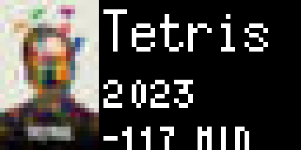

# Tidbyt + Plex

[Tidbyt](https://tidbyt.com/) app that shows what's currently playing on your [Plex](https://plex.tv) media server.



## Installation

This app is not available through Tidbyt's mobile app as it uses features that (for security reasons) are not supported in [community apps](https://tidbyt.dev/docs/publish/community-apps) that run on Tidbyt's official app server.

Instead, it needs to be run using [Pixbyt](https://pixbyt.dev), a self-hosted Tidbyt app server for advanced apps.

### 1. Set up Pixbyt

1. [Create your own Pixbyt repo](https://github.com/DouweM/pixbyt#1-create-your-own-pixbyt-repo)
2. [Configure your Tidbyt](https://github.com/DouweM/pixbyt#2-configure-your-tidbyt)

### 2. Install the app

1. Add this repo as a submodule under `apps`:

    ```bash
    git submodule add https://github.com/DouweM/tidbyt-plex.git apps/plex
    ```

1. Add an update schedule to `apps.yml` under `schedules:`:

    ```yaml
    schedules:
    # ...
    - name: plex
      interval: '* * * * *' # Every minute
      job: plex
    ```

## Configuration

Update `.env` with your configuration:

```bash
PLEX_URL="<url>" # Plex Server URL. If HTTPS, certificate must be valid. Example: 'http://my-nas:32400'
PLEX_TOKEN="<token>" # Plex API Token. See https://support.plex.tv/ articles/204059436-finding-an-authentication-token-x-plex-token/
PLEX_USER_NAME="<user name>" # Filter: User Name. Leave blank to consider  sessions from all users
PLEX_DEVICE_TYPE="<device type>" # Filter: Device Type. Leave blank to  consider sessions from all types of devices. Example: 'Apple TV'
```

## Usage

Build and launch your Pixbyt app server:

1. [Build the app server](https://github.com/DouweM/pixbyt#4-build-the-app-server)
1. [Launch the app server](https://github.com/DouweM/pixbyt#5-launch-the-app-server)
